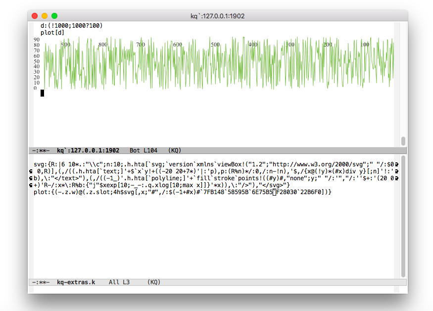

k/q mode for emacs.

-----

###Quickstart

* `(load "/path/to/kq-mode.el")`
* Optional: `(setq kq-default-language "q")`
* `(add-to-list 'auto-mode-alist '("\\.[kq]\\'" . kq-mode))`
* `M-x kq-connect` and connect to your kdb-process

###Interactive Mode
When connected to a remote kdb process, the connected window is interactive: You can type k/q commands
and they will be sent to the remote machine asynchronously. `.q.show` will output to the region right after the command even if another command is sent. `.z.slot` identifies that region to Emacs.

See [kq-extras.k](kq-extras.k) for a `plot` function that will emit a graph into the interactive region (requires Emacs SVG support)
###Major Mode
The KQ major mode attaches to a kdb process. Pressing `C-c C-c` will send the code at the point to kdb
which is convenient for interactive programming.
